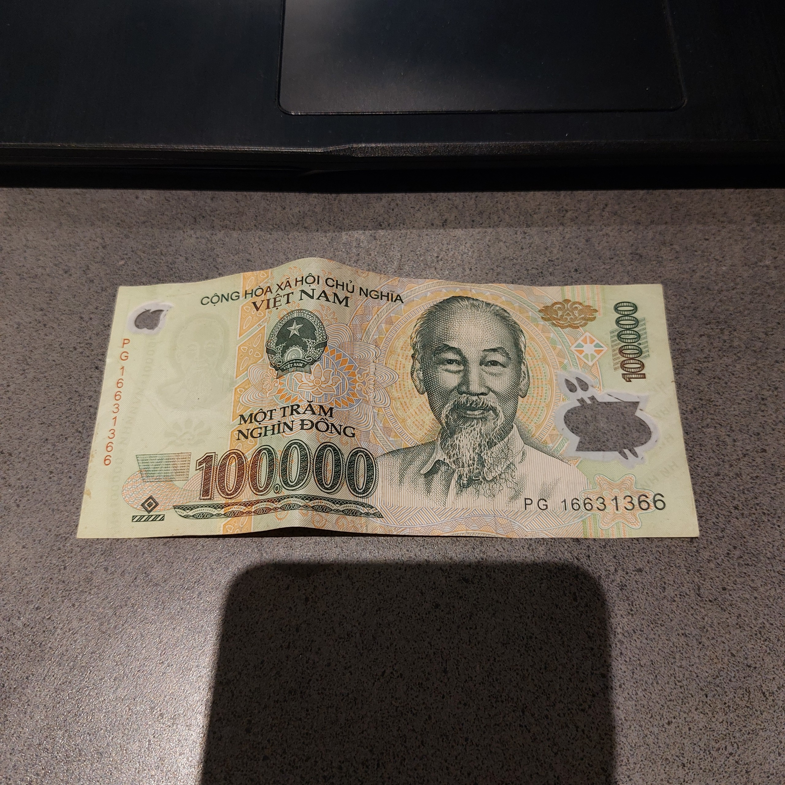
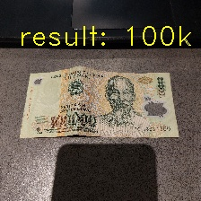

# Money-classification

Check out my 2 YOUTUBE channels for more:
1. [Mrzaizai2k - AI](https://www.youtube.com/channel/UCFGCVG0P2eLS5jkDaE0vSfA) (NEW)
2. [Mrzaizai2k](https://www.youtube.com/channel/UCCq3lQ1W437euT9eq2_26HQ) (old)

Guidelines to use Teachable Machine to hack in AI courses. In this example, I classify 2 types of Vietnamese money (50k and 100k)

I will provide a video explain details of this topic soon:

How to use:
1. If you're comfortable with `PIL`, use `image.py`. If you're acquainted with `OpenCV` use `image cv.py`
2. `cam.py` recognizes utilizing a webcam, which I rewrote.
3. `cam_tm.py` is the original webcam file from Teachable Machine

<i>Figure. Input image </i>

<i>Figure. Prediction </i>

